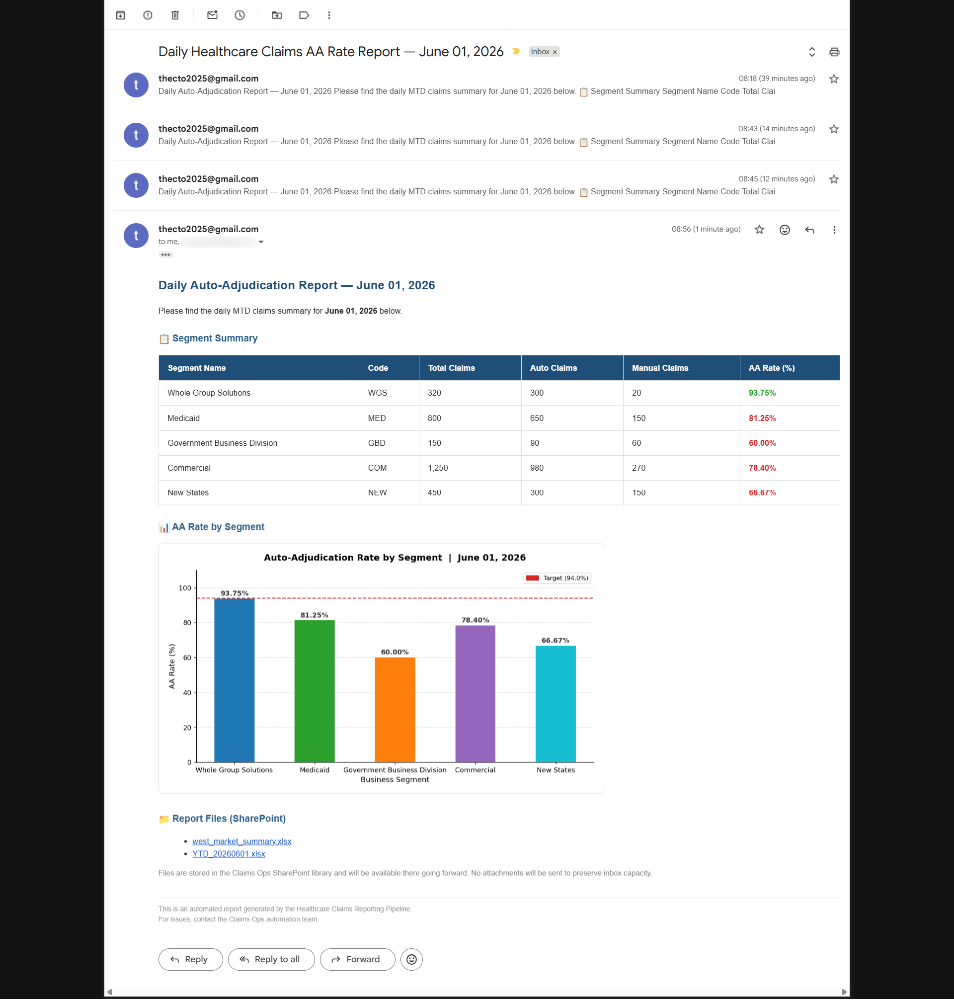
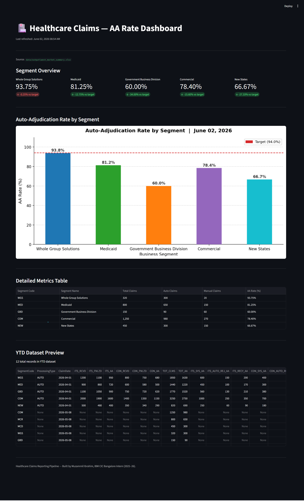
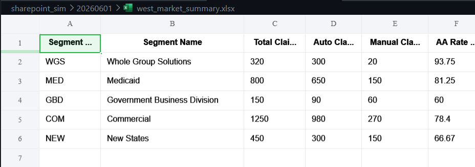
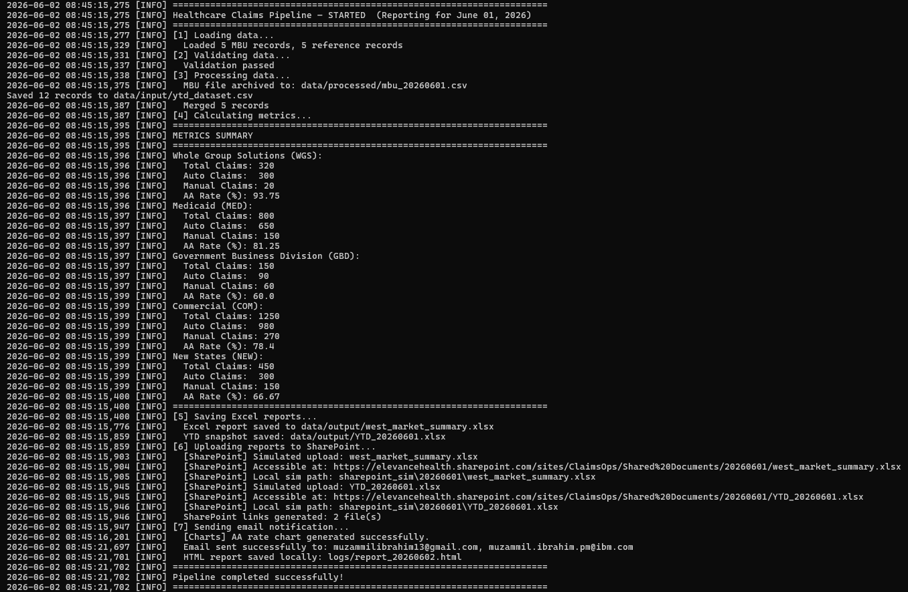

# Healthcare Claims Reporting Pipeline

Python ETL pipeline for transforming simulated healthcare claims extracts into
auto-adjudication reporting metrics and Excel-ready stakeholder outputs.

## Overview

This project models a manual enterprise reporting workflow used in healthcare
claims operations. Raw claims data is ingested from structured files, validated,
merged with reference data, transformed into year-to-date reporting data, and
summarized into auto-adjudication metrics.

The project was inspired by claims reporting workflows observed during an IBM
Consulting Client Innovation Center internship, where operational reports often
depend on mainframe extracts, spreadsheet handling, and recurring stakeholder
updates.

## Problem

Manual claims reporting workflows are often built around repeated file handling,
spreadsheet updates, and ad hoc scripts. That creates several risks:

- **High manual effort:** The daily workflow (extracting MBU files → updating Excel → formatting email summaries) previously required ~45 minutes of manual effort per day.
- Inconsistent report generation
- Higher chance of human error
- Limited reproducibility
- Hard-to-maintain reporting logic

## Solution

This repository rebuilds that workflow as a small, modular Python pipeline, **completing the same reporting workflow in under 2 minutes.**

```text
Claims Extract
    -> Data Ingestion
    -> Validation
    -> Reference Data Merge
    -> YTD Dataset Update
    -> KPI Calculation
    -> Excel Report Generation
    -> Email-ready HTML Summary
```

## Features

- Loads pipe-delimited claims extracts and CSV reference data
- Validates required columns and checks critical fields
- Removes duplicate records during validation and YTD processing
- Merges claims data with segment reference data
- Calculates segment-level auto-adjudication metrics
- Exports report data to an Excel workbook
- Generates HTML summary content for email reporting
- Simulates enterprise SharePoint file uploads for deliverable sharing
- Features a real-time Streamlit dashboard for KPI visualization
- Uses a simple configuration layer for paths, segments, and email metadata

## Metrics Generated

For each configured business segment, the pipeline calculates:

- Total claims
- Auto-processed claims
- Manually processed claims
- Auto-adjudication rate

Configured segments:

- WGS
- Medicaid
- GBD
- Commercial
- New States

## Project Structure

```text
healthcare-claims-reporting-pipeline/
├── src/                          # Core pipeline modules
│   ├── ingestion.py             # Data loading
│   ├── validation.py            # Data quality checks
│   ├── processing.py            # Transformations
│   ├── metrics.py               # KPI calculations
│   ├── report.py                # Excel generation
│   ├── sharepoint.py            # SharePoint simulation
│   └── charts.py                # Visualizations
│
├── data/
│   ├── input/                   # Input CSV files
│   ├── processed/               # Intermediate outputs (git-ignored)
│   └── output/                  # Final Excel reports (git-ignored)
│
├── tests/                        # Unit & integration tests
├── docs/                         # Documentation assets
├── logs/                         # Application logs (git-ignored)
│
├── main.py                       # Pipeline entry point
├── config.py                     # Configuration layer
├── streamlit_app.py             # Dashboard UI
├── requirements.txt             # Dependencies
├── README.md                    # Main documentation
├── DECISIONS.md                 # Architecture decisions
├── SECURITY.md                  # Security guide
└── TESTING.md                   # Test documentation
```

## Tech Stack

- Python
- pandas
- openpyxl
- SMTP/email utilities from the Python standard library
- Streamlit (for dashboard visualization)
- Pytest (for unit testing)

## Getting Started

### Quick Start

Follow these minimal steps to get the project running locally (Windows and Unix variants). These commands assume Python 3.9+ is installed.

Windows (PowerShell):

```powershell
python -m venv .venv
.\.venv\Scripts\Activate.ps1
pip install -r requirements.txt
python main.py            # run the ETL pipeline
streamlit run streamlit_app.py   # run the dashboard
```

macOS / Linux (bash):

```bash
python -m venv .venv
source .venv/bin/activate
pip install -r requirements.txt
python main.py
streamlit run streamlit_app.py
```

Use the commands above for a quick trial; see the detailed steps below for additional setup notes.

### 1. Clone the repository

```bash
git clone https://github.com/muzammil-13/healthcare-claims-reporting-pipeline.git
cd healthcare-claims-reporting-pipeline
```

### 2. Create and activate a virtual environment

```bash
python -m venv .venv
.venv\Scripts\activate
```

### 3. Install dependencies

```bash
pip install -r requirements.txt
```

### 4. Add input files

Place the input files in `data/input/`:

- `sample_mbu.csv`
- `sample_reference.csv`

The sample claims extract uses a pipe-delimited format:

```text
SegmentCode|ClaimDate|TOT_CLMS|TOT_AA|Status
COM|2026-05-08|1250|980|PAID
```

**Important:** For email delivery, set up your SMTP credentials as environment variables to avoid fallback warnings. See [SECURITY.md](SECURITY.md#credential-management) for detailed instructions.

### 5. Run the ETL Pipeline (`main.py`)

`main.py` is the pipeline driver that executes the full ETL and reporting flow for a single reporting run. High-level steps performed by `main.py`:

- Load raw MBU extracts and reference CSVs
- Validate required columns and basic data quality
- Merge claims with reference/segment metadata
- Append new records to the year-to-date dataset
- Calculate segment-level AA metrics and print a summary
- Save the stakeholder Excel report (`data/output/West_Market_Summary.xlsx`)
- Save a YTD Excel snapshot (`data/output/YTD_<YYYYMMDD>.xlsx`)
- Archive the original MBU file to `data/processed/mbu_<YYYYMMDD>.csv`
- Simulate uploading reports to SharePoint and generate links
- Generate and send an email summary (requires SMTP credentials)

Run the pipeline locally with:

```bash
python main.py
```

Notes:
- The script defaults to reporting for yesterday (T-1). Adjust the code if a different reporting date is required.
- Output files created on a successful run:
    - `data/output/West_Market_Summary.xlsx` (primary dashboard/report)
    - `data/output/YTD_<YYYYMMDD>.xlsx` (YTD snapshot)
    - `data/processed/mbu_<YYYYMMDD>.csv` (archived raw extract)
    - `data/processed/ytd_data.csv` (updated year-to-date CSV)
- Email sending uses environment variables for SMTP credentials; if `SMTP_PASSWORD` is present only in `config.ini` a warning is emitted. See `config.py` for details.

### 6. Run the Streamlit Dashboard (`streamlit_app.py`)

The Streamlit app provides a live dashboard for the latest generated report. `streamlit_app.py`:

- Looks for the most recent Excel report matching `data/output/West_Market_Summary*.xlsx` and loads the sheet `West Market Summary`.
- Loads the most recent YTD snapshot matching `data/output/YTD_*.xlsx` (if present) and shows a preview.
- If no generated report is found or loading fails, the app falls back to committed sample input files (`data/input/sample_mbu.csv` and `data/input/sample_reference.csv`) and builds metrics from those.
- Renders KPI metrics, an AA rate chart, and a formatted metrics table.

Run the dashboard locally with:

```bash
streamlit run streamlit_app.py
```

Tips and caveats:
- The dashboard expects the Excel sheet to have the columns produced by `save_excel_report()` (see `src/metrics.py`): `Segment Code`, `Segment Name`, `Total Claims`, `Auto Claims`, `Manual Claims`, `AA Rate (%)`.
- If the most recent Excel file is missing, corrupted, or has a different sheet name the app will use sample data; ensure `main.py` runs successfully to generate the expected report for production use.
- If `df` is empty, the Streamlit layout (for example `st.columns(len(df))`) may error — verify the report contains rows before launching the dashboard in production.


## Sample Output

After a successful run, the pipeline creates:

- `data/processed/ytd_data.csv`
- `data/output/West_Market_Summary.xlsx`
- Console summary of auto-adjudication metrics
- HTML email body content generated from calculated metrics

### Generated Report Preview

**1. Automated Email Notification**  


**2. Streamlit Dashboard Visualization**  


**3. Report Files (SharePoint)**  


**4. Terminal Execution**  


## Configuration

Core settings live in `config.py`, including:

- Input and output paths
- Segment code mappings
- Required column definitions
- Email subject and recipients

SMTP credentials should not be committed to Git. Use a local ignored
configuration file or environment variables for real credentials.

## Current Limitations

- Mainframe extraction is simulated with local input files
- Scheduling is not implemented
- Email sending depends on local SMTP configuration
- Metrics are currently segment-level only

## Future Enhancements

- Add scheduling through cron, Windows Task Scheduler, or Airflow
- Move secrets fully to environment-based configuration
- Add Docker support for reproducible execution

## Author

**Muzammil Ibrahim**  
*IBM CIC Bangalore Intern (2025–26)*

I built this Python ETL pipeline to automate healthcare claims auto-adjudication reporting across 5 business segments. This project reduces daily reporting time from ~45 minutes to under 2 minutes. I designed the system architecture based on real claims operations workflows, handled robust data validation edge cases, and implemented end-to-end automated email delivery.  
**Stack:** Python, Pandas, OpenPyXL, ConfigParser.
