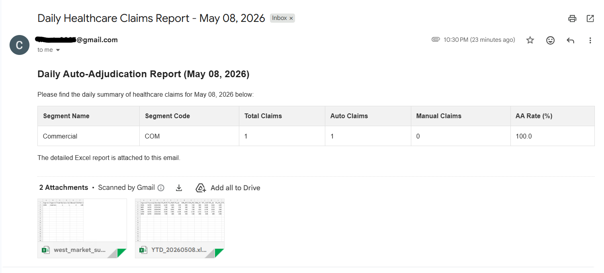
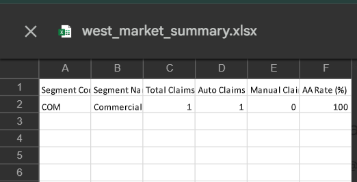

# Healthcare Claims Reporting Pipeline

Python ETL pipeline for transforming simulated healthcare claims extracts into
auto-adjudication reporting metrics and Excel-ready stakeholder outputs.

## Overview

This project models a manual enterprise reporting workflow used in healthcare
claims operations. Raw claims data is ingested from structured files, validated,
merged with reference data, transformed into year-to-date reporting data, and
summarized into auto-adjudication metrics.

The project was inspired by claims reporting workflows observed during an IBM
Consulting Client Innovation Center internship, where operational reports often
depend on mainframe extracts, spreadsheet handling, and recurring stakeholder
updates.

## Problem

Manual claims reporting workflows are often built around repeated file handling,
spreadsheet updates, and ad hoc scripts. That creates several risks:

- **High manual effort:** The daily workflow (extracting MBU files → updating Excel → formatting email summaries) previously required ~45 minutes of manual effort per day.
- Inconsistent report generation
- Higher chance of human error
- Limited reproducibility
- Hard-to-maintain reporting logic

## Solution

This repository rebuilds that workflow as a small, modular Python pipeline, **completing the same reporting workflow in under 2 minutes.**

```text
Claims Extract
    -> Data Ingestion
    -> Validation
    -> Reference Data Merge
    -> YTD Dataset Update
    -> KPI Calculation
    -> Excel Report Generation
    -> Email-ready HTML Summary
```

## Features

- Loads pipe-delimited claims extracts and CSV reference data
- Validates required columns and checks critical fields
- Removes duplicate records during validation and YTD processing
- Merges claims data with segment reference data
- Calculates segment-level auto-adjudication metrics
- Exports report data to an Excel workbook
- Generates HTML summary content for email reporting
- Uses a simple configuration layer for paths, segments, and email metadata

## Metrics Generated

For each configured business segment, the pipeline calculates:

- Total claims
- Auto-processed claims
- Manually processed claims
- Auto-adjudication rate

Configured segments:

- WGS
- Medicaid
- GBD
- Commercial
- New States

## Project Structure

```text
healthcare-claims-reporting-pipeline/
├── data/
│   └── input/
│       ├── mbu_report.txt
│       └── reference_data.csv
├── src/
│   ├── ingestion.py
│   ├── validation.py
│   ├── processing.py
│   ├── metrics.py
│   └── report.py
├── config.py
├── main.py
├── requirements.txt
└── README.md
```

Generated files are written under:

```text
data/processed/
data/output/
logs/
```

These generated outputs are intentionally ignored by Git.

## Tech Stack

- Python
- pandas
- openpyxl
- SMTP/email utilities from the Python standard library

## Getting Started

### 1. Clone the repository

```bash
git clone https://github.com/muzammil-13/healthcare-claims-reporting-pipeline.git
cd healthcare-claims-reporting-pipeline
```

### 2. Create and activate a virtual environment

```bash
python -m venv .venv
.venv\Scripts\activate
```

### 3. Install dependencies

```bash
pip install -r requirements.txt
```

### 4. Add input files

Place the input files in `data/input/`:

- `sample_mbu.csv`
- `sample_reference.csv`

The sample claims extract uses a pipe-delimited format:

```text
SegmentCode|ClaimDate|TOT_CLMS|TOT_AA|Status
COM|2026-05-08|1250|980|PAID
```

### 5. Run the pipeline

```bash
python main.py
```

## Sample Output

After a successful run, the pipeline creates:

- `data/processed/ytd_data.csv`
- `data/output/West_Market_Summary.xlsx`
- Console summary of auto-adjudication metrics
- HTML email body content generated from calculated metrics

### Generated Report Preview

**1. Automated Email Notification**  


**2. Generated Excel Summary**  


**3. Terminal Execution**  


## Configuration

Core settings live in `config.py`, including:

- Input and output paths
- Segment code mappings
- Required column definitions
- Email subject and recipients

SMTP credentials should not be committed to Git. Use a local ignored
configuration file or environment variables for real credentials.

## Current Limitations

- Mainframe extraction is simulated with local input files
- Scheduling is not implemented
- Dashboard visualization is not included yet
- Email sending depends on local SMTP configuration
- Metrics are currently segment-level only

## Future Enhancements

- Add unit tests for each pipeline stage
- Add richer validation for dates, status values, and processing types
- Add state-level and month-to-date reporting views
- Add Streamlit or Power BI-ready dashboard output
- Add scheduling through cron, Windows Task Scheduler, or Airflow
- Move secrets fully to environment-based configuration
- Add Docker support for reproducible execution

## Resume Summary

**Built by:** Muzammil Ibrahim, IBM CIC Bangalore Intern (2025–26).

Built a Python ETL pipeline automating healthcare claims auto-adjudication reporting across 5 business segments. Reduced daily reporting time from ~45 minutes to under 2 minutes. Designed system architecture based on real claims operations workflows, handled robust data validation edge cases, and implemented end-to-end automated email delivery. Stack: Python, Pandas, OpenPyXL, ConfigParser.
